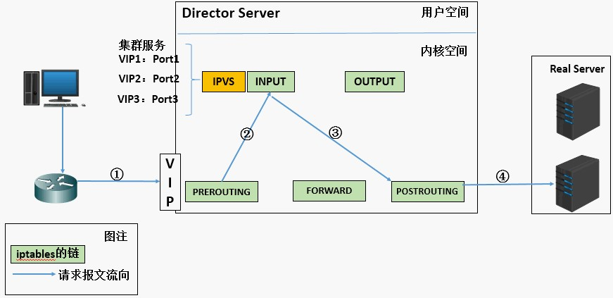
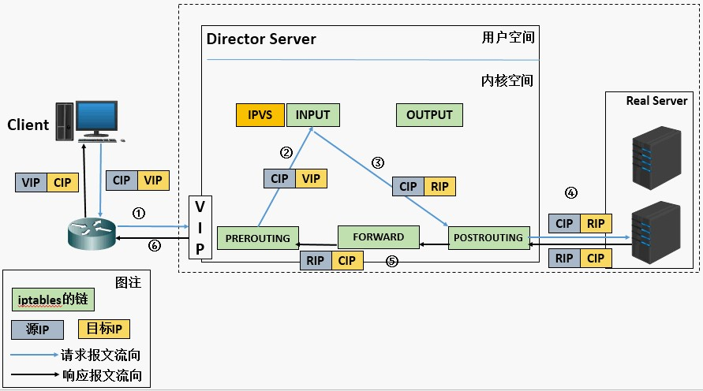
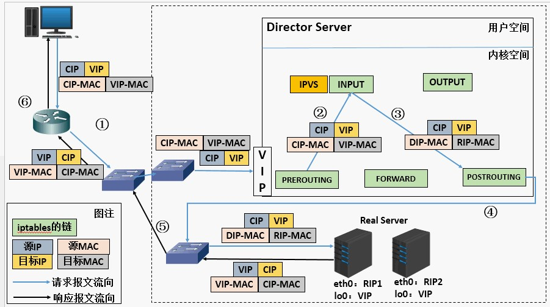
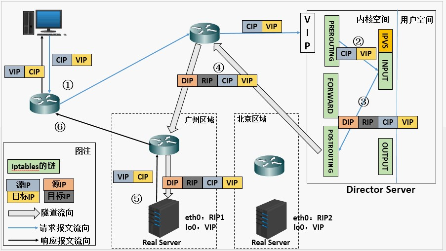

# Linux-Virtual-Server

### 简介

LVS(Linux Virtual Server) 是Unix-like系统中的一个虚拟服务器，是国内贡献给开源组织的一个最优秀的项目之一，作者章文嵩博士。LVS在Unix-like系统中是作为一个前端(Director)存在的,又称为调度器，它本身不提供任何的服务，只是将通过互联网进来的请求接受后再转发给后台运行的真正的服务器(RealServer)进行处理，然后响应给客户端。

### 工作原理

1、当用户向负载均衡调度器（Director Server）发起请求，调度器将请求发往至内核空间

2、PREROUTING链首先会接收到用户请求，判断目标IP确定是本机IP，将数据包发往INPUT链

3、IPVS是工作在INPUT链上的，当用户请求到达INPUT时，IPVS会将用户请求和自己已定义好的集群服务进行比对，如果用户请求的就是定义的集群服务，那么此时IPVS会强行修改数据包里的目标IP地址及端口，并将新的数据包发往POSTROUTING链

4、POSTROUTING链接收数据包后发现目标IP地址刚好是自己的后端服务器，那么此时通过选路，将数据包最终发送给后端的服务器

### LVS组件

IPVS（ip virtual server）：ipvs是LVS的核心组件，它本身只是一个框架，类似于iptables，工作于内核空间中,是真正生效实现调度的代码。

IPVSADM：ipvsadm 是用来定义LVS的转发规则的，工作于用户空间中,负责为ipvs内核框架编写规则，定义谁是集群服务，而谁是后端真实的服务器（Real Server）。

### LVS相关术语

-   DS：Direstor  Server 调度服务器，指LVS服务器

-   RS：Real Server 真正提供服务的服务器

-   VIP：virtual IP 调度服务器面对客户端外部所使用的虚拟 IP ,作为用户请求的目标的IP地址。

-   DIP：Director Server IP 主要用于和内部主机通讯的IP地址

-   RIP：Real Server IP 

-   CIP：Client IP 客户端IP

### LVS工作模式

-   lvs-nat  （Network Address Translation）建议小规模使用。

-   lvs-dr （Direct Routing 直接路由）建议大规模使用，也是现在较多使用场景的方法。

-   lvs-tun  （Tunneling 隧道）lvs-tun模型比较少用，因为他不能实现全局负载均衡，不能根据用户区域的距离来挑选最近的机房。这个最多为了实现异地容灾来实现的。比方说日本的机房地震了，而此时美国的机房仍然可使用，那么只要将指向到美国机房即可。而一般只有这种场景下才会用到隧道机制。

### 模型解析

####    LVS-NAT模型

重点

-   修改目标IP地址为挑选出的RS的IP地址。

-   客户端请求报文与服务端响应报文都经过调度器，调度器面临瓶颈压力。

1、当用户请求到达Director Server，此时请求的数据报文会先到内核空间的PREROUTING链。此时报文的源IP为CIP，目标IP为VIP。

2、PREROUTING检查发现数据包的目标IP是本机，将数据包送至INPUT链。

3、IPVS比对数据包请求的服务是否为集群服务，若是，修改数据包的目标IP地址为后端服务器IP，然后将数据包发至POSTROUTING链。此时报文的源IP为CIP，目标IP为RIP。

4、POSTROUTING链通过选路，将数据包发送给Real Server。

5、Real Server比对发现目标为自己的IP，开始构建响应报文发回给Director Server。此时报文的源IP为RIP，目标IP为CIP。

6、Director Server在响应客户端前，此时会将源 IP 地址修改为自己的 VIP 地址，然后响应给客户端。此时报文的源IP为VIP，目标IP为CIP。

####    LVS-NAT模型的特性：

-   RS应该使用私有地址，RS的网关必须指向DIP

-   DIP和RIP必须在同一个网段内

-   请求和响应报文都需要经过 Director Server，高负载场景中，Director Server 易成为性能瓶颈

-   支持端口映射

-   RS可以使用任意操作系统

####  LVS-DR（直接路由技术）模型  

重点：

-   将请求报文的目标 MAC 地址设定为挑选出的 RS 的 MAC 地址。

-   前端调度器，后端服务器使用同样的 IP 地址，需要解决 IP 地址冲突问题。

-   客户端请求报文经调度服务器，但服务端响应报文可不经调度器直接送达客户端，调度器瓶颈压力减小。

1、当用户请求到达Director Server，此时请求的数据报文会先到内核空间的PREROUTING链。此时报文的源IP为CIP，目标IP为VIP。

2、PREROUTING检查发现数据包的目标IP是本机，将数据包送至INPUT链

3、IPVS比对数据包请求的服务是否为集群服务，若是，将请求报文中的源MAC地址修改为DIP的MAC地址，将目标MAC地址修改RIP的MAC地址，然后将数据包发至POSTROUTING链。此时的源IP和目的IP均未修改，仅修改了源MAC地址为DIP的MAC地址，目标MAC地址为RIP的MAC地址

4、由于DS和RS在同一个网络中，所以是通过二层来传输。POSTROUTING链检查目标MAC地址为RIP的MAC地址，那么此时数据包将会发至Real Server。

5、RS发现请求报文的MAC地址是自己的MAC地址，就接收此报文。处理完成之后，将响应报文通过lo接口传送给eth0网卡然后向外发出。此时的源IP地址为VIP，目标IP为CIP

6、响应报文最终送达至客户端

####    LVS-DR（直接路由技术）模型的特性

-   保证前端路由将目标地址为VIP报文统统发给Director Server，而不是RS

解决方案：

    -   在前端路由器做静态地址路由绑定，将对于VIP的地址仅路由到Director Server
存在问题：用户未必有路由操作权限，因为有可能是运营商提供的，所以这个方法未必实用

    -   arptables：在arp的层次上实现在ARP解析时做防火墙规则，过滤RS响应ARP请求。这是由iptables提供的

    -   修改RS上内核参数（arp_ignore和arp_announce）将RS上的VIP配置在lo接口的别名上，并限制其不能响应对VIP地址解析请求。（最容易实现）

-   RS可以使用私有地址；也可以是公网地址，如果使用公网地址，此时可以通过互联网对RIP进行直接访问

-   RS跟Director Server必须在同一个物理网络中

-   所有的请求报文经由Director Server，但响应报文必须不能进过Director Server

-   不支持地址转换，也不支持端口映射

-   RS可以是大多数常见的操作系统

-   RS的网关绝不允许指向DIP(因为我们不允许他经过director)

-   RS上的lo接口配置VIP的IP地址

缺陷：RS和DS必须在同一机房中

####    LVS-Tun模型

重点：在原有的IP报文外再次封装多一层IP首部，内部IP首部（源地址为CIP，目标 IP 为 VIP ），外层 IP 首部（源地址为 DIP，目标 IP 为 RIP）

1、当用户请求到达Director Server，此时请求的数据报文会先到内核空间的 PREROUTING 链。此时报文的源IP为CIP，目标IP为VIP。

2、PREROUTING检查发现数据包的目标IP是本机，将数据包送至INPUT链

3、IPVS比对数据包请求的服务是否为集群服务，若是，在请求报文的首部再次封装一层 IP 报文，封装源 IP 为为 DIP，目标 IP 为 RIP。然后发至POSTROUTING 链。此时源 IP 为 DIP，目标 IP 为 RIP

4、POSTROUTING链根据最新封装的IP报文，将数据包发至RS（因为在外层封装多了一层IP首部，所以可以理解为此时通过隧道传输）。此时源IP为DIP，目标IP为RIP

5、RS接收到报文后发现是自己的IP地址，就将报文接收下来，拆除掉最外层的IP后，会发现里面还有一层IP首部，而且目标是自己的lo接口VIP，那么此时RS开始处理此请求，处理完成之后，通过lo接口送给eth0网卡，然后向外传递。此时的源IP地址为VIP，目标IP为CIP

6、响应报文最终送达至客户端

####    LVS-Tun模型特性

-   RIP、VIP、DIP全是公网地址
-   RS的网关不会也不可能指向DIP
-   所有的请求报文经由Director Server，但响应报文必须不能经过 Director Server
-   不支持端口映射
-   RS的系统必须支持隧道

### LVS算法调度

####  静态调度：

-   RR（Round Robin）:轮询调度

    轮询调度算法的原理是每一次把来自用户的请求轮流分配给内部中的服务器，从1开始，直到N(内部服务器个数)，然后重新开始循环。算法的优点是其简洁性，它无需记录当前所有连接的状态，所以它是一种无状态调度。

-   WRR：weight,加权轮询（以权重之间的比例实现在各主机之间进行调度）

    由于每台服务器的配置、安装的业务应用等不同，其处理能力会不一样。所以，我们根据服务器的不同处理能力，给每个服务器分配不同的权值，使其能够接受相应权值数的服务请求。

-   SH:source hashing,源地址散列。

     主要实现会话绑定，能够将此前建立的session信息保留了源地址散列调度算法正好与目标地址散列调度算法相反，它根据请求的源IP地址，作为散列键（Hash Key）从静态分配的散列表找出对应的服务器，若该服务器是可用的并且没有超负荷，将请求发送到该服务器，否则返回空。它采用的散列函数与目标地址散列调度算法的相同。它的算法流程与目标地址散列调度算法的基本相似，除了将请求的目标IP地址换成请求的源IP地址。

-   DH:Destination hashing:目标地址散列。把同一个IP地址的请求，发送给同一个server。

     目标地址散列调度算法也是针对目标IP地址的负载均衡，它是一种静态映射算法，通过一个散列（Hash）函数将一个目标IP地址映射到一台服务器。目标地址散列调度算法先根据请求的目标IP地址，作为散列键（Hash Key）从静态分配的散列表找出对应的服务器，若该服务器是可用的且未超载，将请求发送到该服务器，否则返回空。

####   动态调度：

-   LC（Least-Connection）：最少连接

    最少连接调度算法是把新的连接请求分配到当前连接数最小的服务器，最小连接调度是一种动态调度短算法，它通过服务器当前所活跃的连接数来估计服务器的负载均衡，调度器需要记录各个服务器已建立连接的数目，当一个请求被调度到某台服务器，其连接数加1，当连接中止或超时，其连接数减一，在系统实现时，我们也引入当服务器的权值为0时，表示该服务器不可用而不被调度。

    简单算法：active*256+inactive(谁的小，挑谁)

 -   WLC(Weighted Least-Connection Scheduling)：加权最少连接。

    加权最小连接调度算法是最小连接调度的超集，各个服务器用相应的权值表示其处理性能。服务器的缺省权值为1，系统管理员可以动态地设置服务器的权限，加权最小连接调度在调度新连接时尽可能使服务器的已建立连接数和其权值成比例。

    简单算法：（active*256+inactive）/weight【（活动的连接数+1）/除以权重】（谁的小，挑谁）

-   SED(Shortest Expected Delay)：最短期望延迟

    基于wlc算法

    简单算法：（active+1)*256/weight 【（活动的连接数+1）*256/除以权重】

-   NQ（never queue）:永不排队（改进的sed）

    无需队列，如果有台realserver的连接数＝0就直接分配过去，不需要在进行sed运算。

-   LBLC（Locality-Based Least Connection）：基于局部性的最少连接

     基于局部性的最少连接算法是针对请求报文的目标IP地址的负载均衡调度，不签主要用于Cache集群系统，因为Cache集群中客户请求报文的布标IP地址是变化的，这里假设任何后端服务器都可以处理任何请求，算法的设计目标在服务器的负载基本平衡的情况下，将相同的目标IP地址的请求调度到同一个台服务器，来提高个太服务器的访问局部性和主存Cache命中率，从而调整整个集群系统的处理能力。

    基于局部性的最少连接调度算法根据请求的目标IP地址找出该目标IP地址最近使用的RealServer，若该Real Server是可用的且没有超载，将请求发送到该服务器；若服务器不存在，或者该服务器超载且有服务器处于一半的工作负载，则用“最少链接”的原则选出一个可用的服务器，将请求发送到该服务器。

-   LBLCR（Locality-Based Least Connections withReplication）：带复制的基于局部性最少链接

     带复制的基于局部性最少链接调度算法也是针对目标IP地址的负载均衡，该算法根据请求的目标IP地址找出该目标IP地址对应的服务器组，按“最小连接”原则从服务器组中选出一台服务器，若服务器没有超载，将请求发送到该服务器；若服务器超载，则按“最小连接”原则从这个集群中选出一台服务器，将该服务器加入到服务器组中，将请求发送到该服务器。同时，当该服务器组有一段时间没有被修改，将最忙的服务器从服务器组中删除，以降低复制的程度。